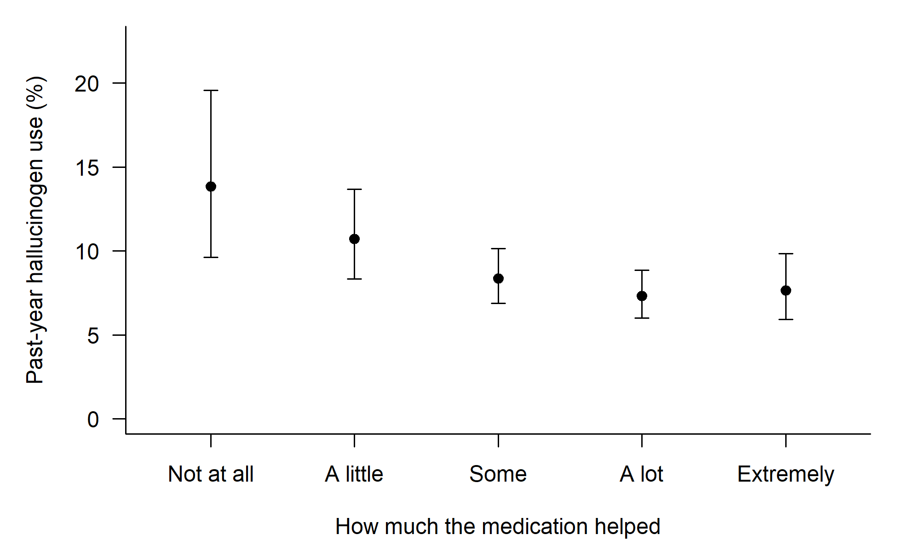
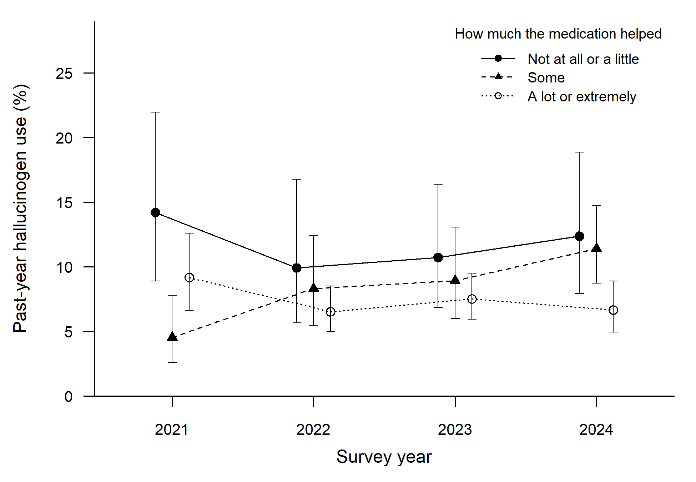

# Rated benefit of depression medication and hallucinogen use among U.S. adults with a past-year major depressive episode, 2021–2024

> **Work in progress, not peer reviewed.** A manuscript is in preparation, and the results may change.

## Introduction

Many people say their depression treatment is not helping. In the 2015–2016 National Survey on Drug Use and Health
(NSDUH), 20.7% of adults with a major depressive episode in outpatient treatment rated their treatment as helping a
little or not at all (Alang and McAlpine, 2020). Such a rating is hard to interpret. It can reflect a lack of benefit,
but also intolerable side effects or having stopped the medication. It is not the same as treatment-resistant
depression, which is usually defined as an inadequate response to at least two adequate antidepressant trials (McIntyre
et al., 2023).

At the same time, interest in psychedelics as treatments for depression has grown. This project asks a simple question:

**Among U.S. adults with depression who took prescription medication for it, is hallucinogen use more common among those
who say the medication helped little?**

If it is, there are at least four possible explanations:

1. **Self-treatment:** people turn to hallucinogens because their medication is not working.
2. **Hallucinogen use came first:** people stop their medication, or rate it as unhelpful, around their hallucinogen
   use.
3. **Other substance use:** something else in their substance use drives both.
4. **Unmeasured confounding:** another factor, not measured in the survey, explains both.

## Data and methods

- **Data:** NSDUH public-use files for 2021–2024, a national probability survey of U.S. households. Response rates were
  low (10.3% to 12.3%), so estimates may be biased if people who use drugs or have mental disorders take part less
  often.
- **Who:** 9,615 adults with a past-year major depressive episode who took prescription medication for it.
- **Exposure:** how much they said the medication had helped in the past 12 months. The survey asks about prescription
  medication for mood without naming it, so it may not be an antidepressant. The answers were grouped into three levels:

  | Group | Answers | n |
  |---|---|---|
  | Low benefit | not at all, or a little | 1,837 |
  | Intermediate benefit | some | 2,923 |
  | High benefit | a lot, or extremely | 4,855 |

- **Outcome:** any hallucinogen use in the past year.
- **Analysis:** survey-weighted logistic regression, adjusted for sociodemographic characteristics, area, survey year
  and depression severity, with adjusted prevalences for each group.
- **The main comparison** is low vs high benefit. The other analyses are exploratory.

## Results

*Figure 1. Past-year hallucinogen use by how much the medication helped, NSDUH 2021–2024. Weighted, unadjusted
prevalences with 95% confidence intervals.*

**Hallucinogen use was more common among those who said the medication had helped little.** The share using
hallucinogens was:

| | Low benefit | Intermediate | High benefit |
|---|---|---|---|
| Unadjusted | 11.7% | 8.4% | 7.4% |
| Adjusted | 10.6% [8.5, 13.1] | 8.6% [7.2, 10.3] | 7.6% [6.5, 8.8] |

After adjustment, the main comparison was a difference of **3.0 percentage points** (95% CI 0.5 to 5.4; p = .018), an
adjusted prevalence ratio of **1.39** [1.08, 1.78]. Unadjusted, the difference was 4.3 points [1.5, 7.1], and the ratio
1.58 [1.21, 2.06].

**But the difference is modest.** It held up in checks that used a different model, left out people whose depression
status was imputed, or included adults with any lifetime depressive episode (2.4 to 3.0 points). It was smaller, and no
longer clearly different from zero, in the analyses addressing the alternative explanations:

| Analysis | Difference, low vs high benefit (percentage points) |
|---|---|
| Main comparison | 3.0 [0.5, 5.4] |
| Further adjusted for cannabis use, alcohol use disorder, marital status and employment | 1.9 [−0.2, 4.0] |
| Only adults still taking the medication | 1.8 [−0.9, 4.5] |
| Narrower outcome: a proxy for classic-psychedelic use | 1.9 [−0.3, 4.1] |

An unmeasured confounder linked to both the rating and hallucinogen use by risk ratios of 1.39 could be enough to make
the confidence interval include no difference (the E-value for the confidence limit).

**Many people in the low-benefit group had stopped the medication.** Only 62.0% of them were still taking it, against
95.2% in the high-benefit group. So the low-benefit group mixes people still taking the medication with people who had
stopped. A low rating is a self-report, not a diagnosis of treatment-resistant depression, and the survey cannot show how
many in this group would meet that definition.

**Specific substances (exploratory).** These are adjusted differences, low minus high benefit, in percentage points.
The LSD model used the main covariates; the others used a reduced set because there were fewer users.
- LSD use was 2.1 points more common [0.4, 3.7], and MDMA (ecstasy) use 1.0 point more common [0.1, 2.0].
- Ketamine showed no clear difference (0.3 [−0.6, 1.2]).
- Past-year psilocybin use, available only for 2024, was imprecise (2.2 [−2.0, 6.5]).

*Figure 2. Past-year hallucinogen use by survey year and how much the medication helped. Weighted, unadjusted
prevalences with 95% confidence intervals. The 2021 estimates depend on survey weights whose adjustment for the
change in interview mode could not be verified.*

**Over time (exploratory).** Change across 2021–2024 differed between the groups (interaction p = .009). The crude yearly
estimates suggest this mainly reflects the intermediate group, which rose from 4.5% in 2021 to 11.4% in 2024. The
low-benefit group did not rise (14.2% in 2021, 12.4% in 2024). This result depends on the 2021 weights (see the caption).

## Conclusion

- **The association:** among U.S. adults with a past-year major depressive episode who took prescription medication for
  their mood, hallucinogen use was modestly more common among those who said it helped not at all or only a little.
- **Its limits:** the difference was not clear after further adjustment for substance use and social circumstances,
  among people still taking the medication, or with the narrower classic-psychedelic outcome.
- **What it cannot show:** the rating and the drug use cover the same year, so the data cannot separate self-treatment
  from the other explanations.
- **What the rating is not:** a low rating of how much the medication helped is a self-report, not a diagnosis of
  treatment-resistant depression. Only 62.0% of adults who gave one were still taking the medication.

## Data and references

- Substance Abuse and Mental Health Services Administration, 2025. *2024 National Survey on Drug Use and Health:
  public use file data users' guide.* Center for Behavioral Health Statistics and Quality, Rockville, MD.
  https://www.samhsa.gov/data/data-we-collect/nsduh-national-survey-drug-use-and-health/datafiles
- Alang, S., McAlpine, D., 2020. Treatment modalities and perceived effectiveness of treatment among adults with
  depression. *Health Serv. Insights* 13, 1178632920918288. https://doi.org/10.1177/1178632920918288
- McIntyre, R.S., et al., 2023. Treatment-resistant depression: definition, prevalence, detection, management, and
  investigational interventions. *World Psychiatry* 22(3), 394–412. https://doi.org/10.1002/wps.21120
